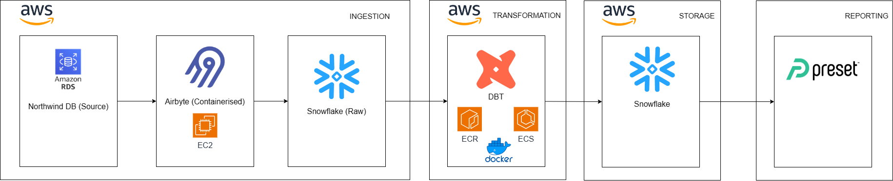
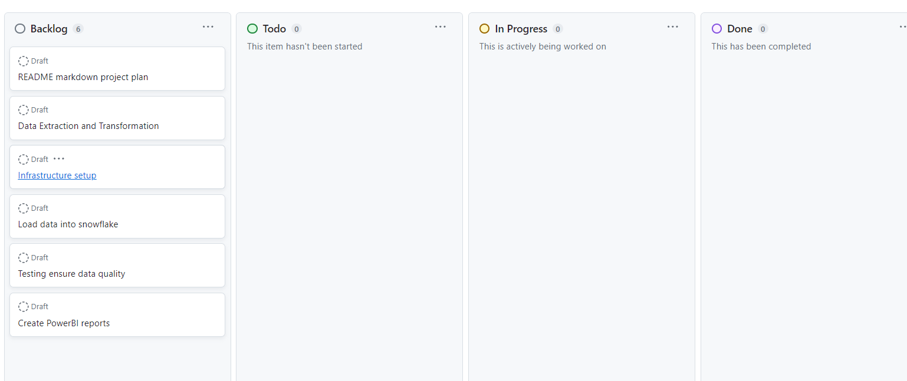

# Project plan

## Objective

The objective of our project is to provide analytical datasets from our Northwind database.

## Consumers

The users of our datasets are Data Analysts. From dashboards using Power BI and Tableau.

## Questions

> - How many order by regions, and territories and ship_countries?
> - Time between order-date and ship-date? delay in shipment, lead time
> - Which supplier has the most popular the product?
> - Which supplier can cover the most orders?
> - How many orders packed by each employee?

## Source datasets

| Source name                     | Source type         | Source documentation                                          |
| ------------------------------- | ------------------- | ------------------------------------------------------------- |
| Northwind database for Postgres | PostgreSQL database | [Source](https://github.com/pthom/northwind_psql/tree/master) |

## Solution architecture

**Architecture:**

1. **Source Database (PostgreSQL on AWS RDS):** Holds raw data.
2. **Airbyte on EC2:** Extracts data from RDS.
3. **DBT:** Transforms data.
4. **Snowflake Data Warehouse:** Stores transformed data.
5. **Preset:** Uses data for visualization.

**Patterns:**

- **Data Extraction:** Batch extraction with Airbyte.
- **Data Loading:** Batch loading to Snowflake.
- **Data Transformation:** ELT pattern.

Here is a solution architecture diagram:

## Breakdown of tasks

We used the github project kanban to manage our project.

**Tasks:**

1. **Data Extraction and Transformation:**

   - DE: Extract data using Airbyte.
   - DE: Transform data using DBT.

2. **Infrastructure Setup:**

   - CA: Provision EC2, Snowflake, and Databricks.
   - CA: Set up monitoring.

3. **Data Loading and Quality:**

   - DE: Load data into Snowflake.
   - DA and DE: Ensure data quality.

4. **Analytics and Visualization:**

   - DA: Create Power BI reports.

This simplified breakdown helps clarify who does what in the project and ensures clear responsibility assignments for each task.

